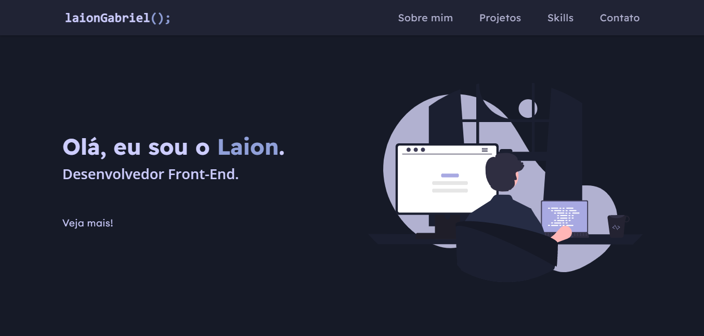

# Portfólio

Portfólio pessoal desenvolvido com HTML, CSS e JavaScript vanilla. O objetivo do site é apresentar minhas habilidades e projetos de forma clara e intuitiva.

Abaixo, você pode ver uma captura da tela inicial:

Para ver o site em funcionamento, basta acessar [este link](https://laiongabriel.github.io/portfolio/). Se você tiver alguma dúvida ou sugestão, fique à vontade para entrar em contato comigo!

